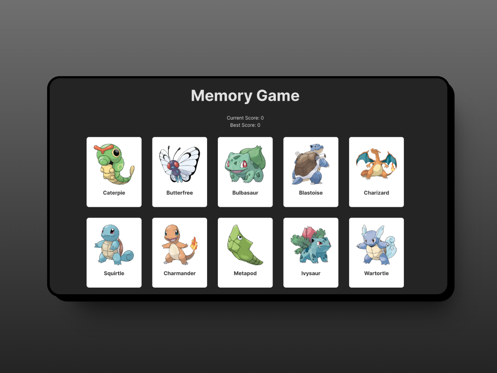

## Table of Contents

1. [Description](#description)
1. [Demo](#demo)
1. [Design](#design)
1. [Features](#features)
1. [Technologies Used](#technologies-used)
1. [Project Challenges](#project-challenges)
1. [Thoughts and Observations](#thoughts-and-observations)
1. [Future Enhancements](#future-enhancements)
1. [Installation](#installation)

## Description

This project is about memory card game. The user will be presented with 12 pokemon cards and they will click it at least once until they got the highest score.

## Demo

Click here: [https://memory-game-2025.netlify.app/](https://memory-game-2025.netlify.app/)

## Design

<div align='center'>

</div>

## Features

- Complete the game by achieving a perfect score of 12!

## Technologies Used

- React JS

## Project Challenges

One of the challenges I faced is structuring the components and how I will connect them with the logic of the game. I read a couple of react articles from the official docs , and it helped me to formulate a solution.

## Thoughts and Observations

Share any insights or reflections you have from working on the project. This could include your thoughts on the development process, design decisions etc. Looking back, I haven't really committed on making this project a complete game. I just did this to practice my react skills, specially the concept behind react states and how to fetch API in React JS.

## Future Enhancements

- Add game difficulty options
- Add user login option
- Add leaderboard

## Installation

1. Clone the GitHub repository to your local machine:

   ```bash
   git clone https://github.com/frrst-ian/memory-game.git
   ```

2. Navigate to the project's directory:

   ```bash
   cd memory-game
   ```

3. Install the project's dependencies using npm:

   ```bash
   npm install
   ```

4. To build the project:

   ```bash
   npm run build
   ```